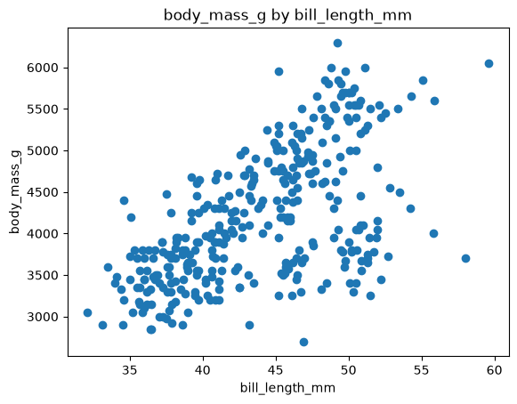

# Project Documentation

Use the navigation to explore project instructions,
concepts, data, and code documentation.

## Shared Workflow

Many projects use the same professional workflow.

See [**Workflow B: Apply Example Project**](https://denisecase.github.io/pro-analytics-02/workflow-b-apply-example-project/)
to get a project like this running on your machine.

Use these pages as you work:

- **Home** - that's this landing page
- [**Project Instructions**](./project-instructions.md) - what to do for this specific project
- [**Concepts**](./concepts.md)  - for important ideas and terms introduced in this module
- [**Data Card**](./data-card.md) - for information about the project data
- [**API**](./api.md) - for details about the Python functions available in this project

## Professional Projects

- We code like the pros to help us **focus on the analytics**.
- Most files in this repository will never be touched.
- If curious about a file, check out the
  [Professional Python Project Explainer](https://denisecase.github.io/professional-python-project-explainer/).

## Initial Visualization Results

After reviewing the dataset, use the code in the **src/datafun** folder to select a possible prediction target
and a feature that might help predict that target.

Choose numeric columns for both the target and feature.

When the project runs, the code generates a scatter plot showing
the relationship between the two selected columns.

